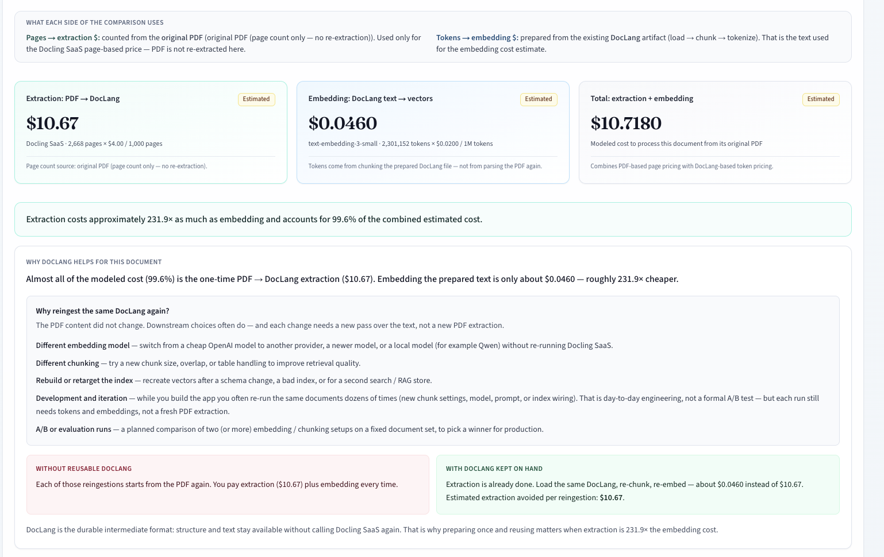

# DocLang Reingestion Savings

**Related projects**

| Project | What it is | How this demo uses it |
|---------|------------|------------------------|
| [DocLang](https://github.com/doclang-project/doclang) ([doclang.ai](https://www.doclang.ai/)) | AI-native document format (spec + toolkit). Keeps structure, semantics, and layout in a form that works well for LLM / RAG pipelines. | We treat prepared DocLang (`.dclx`) as the **durable intermediate**: load → chunk → count tokens → estimate embedding cost. We do not re-extract the PDF. |
| [Docling](https://github.com/docling-project/docling) (open source) / [Docling for IBM watsonx](https://www.ibm.com/products/docling) (SaaS) | Document conversion for gen AI. OSS toolkit prepares PDFs and other files; the managed service is priced from **USD 4 per 1,000 pages**. | **Docling SaaS** is the priced extraction step (PDF → DocLang). We load archives with [`docling-core`](https://pypi.org/project/docling-core/) (`DoclingDocument.load_from_doclang_archive`) — no OCR or layout inference in this app. |

This demo is **aligned** with DocLang’s idea: once content is in DocLang, downstream work (chunking, embedding, indexing, evaluation) can reuse that representation instead of starting from the PDF again. We only measure the **cost side** of that story (extraction $ vs embedding $). We do not implement the DocLang validate/pack toolkit, and we do not run Docling extraction here.

---

This demo answers one question:

**If I convert a PDF to DocLang with [Docling SaaS](https://www.ibm.com/products/docling), how does that extraction cost compare to embedding the text afterward?**

---

## Why DocLang helps (business context)

**Extraction (PDF → DocLang) is usually the expensive step.** Embedding the prepared text is cheap by comparison. On a large filing you often see something like:

| Step | What it is | Typical share of combined $ |
|------|------------|-----------------------------|
| Extraction | Docling SaaS turns the PDF into DocLang | ~99% |
| Embedding | Vectors from the DocLang text | ~1% |



### Why reingest the same DocLang again?

The PDF did not change. Downstream choices often do — and each change needs a new pass over the text, **not** a new PDF extraction.

| Common reason to reingest | What you change | What stays the same |
|---------------------------|-----------------|---------------------|
| **New embedding model** | OpenAI → another provider, a newer model, or a local model (e.g. Qwen) | Same DocLang file |
| **New chunking** | Chunk size, overlap, table packing — to improve retrieval | Same DocLang file |
| **Rebuild / retarget the index** | Schema change, corrupted index, or a second search / RAG store | Same DocLang file |
| **Development and iteration** | Whatever you are debugging today — chunk settings, model, prompts, index wiring. You often re-run the same documents dozens of times while building. | Same DocLang file |
| **A/B or evaluation** | A planned comparison of two (or more) setups on a fixed set, to pick a production winner | Same DocLang file |

Without reusable DocLang, each of those runs starts from the PDF again, so you pay **extraction + embedding** every time.

With DocLang kept on hand, extraction is already paid. You load the same archive, re-chunk, re-embed — and mostly pay the **small embedding estimate**.

**DocLang is the durable intermediate format.** Structure and text stay available without calling Docling SaaS again. That is why preparing once and reusing matters when extraction is 100×+ the embedding cost.

The UI shows this under the results as **Why DocLang helps for this document**, including the list of reingestion reasons and the estimated extraction avoided on the next run.

---

## What this app is (and is not)

The app does **not** run Docling SaaS extraction. The DocLang files already exist. The app only:

1. Counts the **pages of the original PDF**. This gives the extraction price estimate.
2. Loads the prepared **DocLang** file, splits it into chunks, and counts **tokens**. This gives the embedding price estimate.
3. Shows both dollar numbers side by side, with the ratio.

By default no embeddings are generated. You only need token counts to estimate an embedding bill. A "full run" with local Qwen embeddings is optional.

| This app does | This app does not |
|---------------|-------------------|
| Read existing `.dclx` DocLang files | Extract text from PDFs with Docling |
| Count PDF pages (with pypdf, no OCR) | Run OCR or layout models |
| Chunk DocLang text and count tokens | Call OpenAI or any paid API |
| Estimate Docling SaaS $ vs embedding $ | Index a vector database or answer questions |

Think of it as a **cost calculator that uses real document size** (pages and tokens). It is not a full ingestion pipeline.

---

## How the comparison works

```
PDF      ──(page count only)──────────►  extraction $ = pages / 1000 × price_per_1000_pages
DocLang  ──(load → chunk → tokenize)──►  embedding $  = tokens / 1,000,000 × price_per_million_tokens
```

- **Pages** come from the matching PDF. If there is no PDF, the app uses the page list inside the DocLang file. You can also type the page count by hand.
- **Tokens** are counted per chunk, so they include the chunk overlap and repeated headings. This matches what you would really send to an embedding API.
- Two token counts are shown:
  - **Paid-model tokens** (tiktoken `cl100k_base` by default, which is the tokenizer of OpenAI `text-embedding-3-*`). This number drives the embedding $.
  - **Local Qwen tokens** (exact, from the `Qwen/Qwen3-Embedding-0.6B` tokenizer). These are for reference only.

With the defaults ($4 per 1,000 pages, `text-embedding-3-small` at $0.02 per 1M tokens), extraction is usually more than 100× the embedding cost for long financial filings.

---

## How chunking works (`chunking.py`)

Chunk settings change the token count, so it is useful to know what happens:

1. The DocLang document is exported to markdown (`export_to_markdown`).
2. The markdown is split into **headings**, **paragraphs** and **tables**.
3. Blocks are packed into chunks of at most `chunk_size` characters (default 1000).
4. Every new chunk starts with its **section heading**, so each chunk keeps its context.
5. Neighbouring chunks share the last `chunk_overlap` characters (default 150). The overlap can be at most half the chunk size.
6. Big tables are split into row groups. **Each group repeats the table header row.**
7. The column padding spaces from the markdown table export are removed, because they are not real content.

More overlap means more tokens, and so a higher embedding $. The difference is small compared to extraction.

---

## How the code is organized

```
doclang-reingestion-demo/
├── package.json             Shortcuts: npm run backend | frontend | test
├── backend/                 Python FastAPI API (port 8000)
│   ├── app/
│   │   ├── main.py          HTTP routes (/api/...)
│   │   ├── config.py        Reads backend/.env
│   │   ├── minio_service.py List and download objects (read-only)
│   │   ├── local_source.py  Scan data/cache and LOCAL_DOCS_DIR
│   │   ├── pairing.py       Match DocLang ↔ PDF by file name
│   │   ├── cache.py         Safe download paths under data/cache
│   │   ├── pages.py         PDF page count (pypdf) or DocLang pages
│   │   ├── doclang_loader.py  Load .dclx with docling-core
│   │   ├── chunking.py      Split markdown into chunks
│   │   ├── tokens.py        Qwen tokenizer + paid-model token estimate
│   │   ├── embeddings.py    Optional local Qwen embeddings (slow on CPU)
│   │   ├── cost.py          Dollar formulas and ratios
│   │   ├── jobs.py          Background jobs (one benchmark at a time)
│   │   └── schemas.py       Request and response models
│   ├── tests/
│   ├── data/cache/          Downloaded files (gitignored)
│   ├── data/local/          Your own local copies (gitignored)
│   ├── data/runs/           Saved run results as JSON (gitignored)
│   ├── .env.example
│   └── requirements.txt
└── frontend/                Next.js UI (port 3000)
    └── src/
        ├── app/page.tsx                          Main dashboard
        ├── components/CostComparisonResults.tsx  Cost results
        └── lib/api.ts                            API client and types
```

### What happens when you click "Estimate cost"

1. The UI calls `GET /api/documents?source=local` (or `minio`). The backend lists the DocLang files and pairs each one with a PDF.
2. You select documents and click **Estimate cost (no embedding)**.
3. The UI calls `POST /api/jobs/process` with `skip_embedding: true`.
4. A background job in `jobs.py` runs, for each document:
   - find the `.dclx` on disk (or download it from MinIO, depending on source and run mode)
   - count PDF pages if the page count is not known yet (`pages.py`)
   - load the DocLang archive (`doclang_loader.py`)
   - chunk it (`chunking.py`)
   - count tokens (`tokens.py`)
   - calculate costs (`cost.py`)
5. The UI polls `GET /api/jobs/{id}` every 0.5 s. It shows live logs, then the results.
6. The result is saved to `backend/data/runs/<job_id>.json` and appears in **History**.

In cost-only mode the embedding model is never loaded. The **Qwen tokenizer** is still loaded to count local tokens. The first run downloads it from Hugging Face (about 10 MB).

If you choose **Full run**, step 4 also loads `Qwen/Qwen3-Embedding-0.6B` and generates vectors (`embeddings.py`). On CPU this can take many minutes for a large filing.

### Run modes

| Mode | Meaning |
|------|---------|
| **Staged** (default) | The DocLang file must already be on disk. Timing does not include download. |
| **Download inclusive** | Downloads from MinIO inside the measured run, so download time is included. |

If staged mode says "requires cached DocLang", click **Download selected** first, or switch the source to local disk.

---

## Data sources: MinIO and local disk

### Secrets live in `backend/.env` only

Put credentials and your real bucket settings in **`backend/.env`**. That file is gitignored.

| Put in `backend/.env` | Do not put in git / README |
|-----------------------|----------------------------|
| `MINIO_ENDPOINT` | Real hostnames |
| `MINIO_ACCESS_KEY` | Access keys |
| `MINIO_SECRET_KEY` | Secret keys / session tokens |
| `MINIO_BUCKET`, `MINIO_PREFIX` | Your real bucket and folder names |
| `MINIO_SECURE` | — |

`backend/.env.example` is a template with placeholders only. Copy it, then fill in real values:

```bash
cd backend
cp .env.example .env
# edit .env with your MinIO / COS credentials
```

The backend loads `backend/.env` on startup (`config.py`). Keys never go to the frontend; the UI only sees connection status (host, bucket, prefix, errors) — not access or secret keys.

### Object layout (example names)

Use whatever prefix you set in `.env`. A common layout:

| Path under your prefix | Role |
|------------------------|------|
| `dclx/` | Prepared DocLang (`.dclx`). Required. |
| `pdf/` | Original PDFs. Used only for the page count. |
| `json/` | Optional. Never used as a silent fallback when DocLang fails to load. |

Example placeholders (not real credentials):

```env
MINIO_ENDPOINT=minio.example.com:9000
MINIO_SECURE=true
MINIO_BUCKET=your-bucket
MINIO_PREFIX=docs/
MINIO_ACCESS_KEY=your-access-key
MINIO_SECRET_KEY=your-secret-key
```

MinIO access is **read-only**: the app only lists and downloads. It never writes or deletes remote objects.

You can download once, then use **Document source → Local disk**. After that MinIO is not needed:

```text
backend/data/cache/<your-prefix>/dclx/*.dclx
backend/data/cache/<your-prefix>/pdf/*.pdf
```

Or put copies under `backend/data/local/...` (`LOCAL_DOCS_DIR`). Downloads always come from MinIO, so the **Download** button is disabled for the local source.

---

## Setup

Requirements: Python 3.12, Node.js 20+.

### Backend

```bash
cd backend
cp .env.example .env
# Edit backend/.env — put real MINIO_* credentials there only (never commit .env)

python3.12 -m venv .venv
source .venv/bin/activate
pip install -r requirements.txt

uvicorn app.main:app --reload --port 8000
```

After changing `.env`, click **Reload connection** in the UI (or restart uvicorn) so the backend re-reads it.
### Frontend (second terminal)

```bash
cd frontend
npm install
npm run dev
```

Open http://localhost:3000.

The frontend forwards `/api/*` to port 8000. **Both processes must be running.** If only the UI is running, you will see "Internal Server Error" and an empty Connection panel.

From the repo root you can also use `npm run backend`, `npm run frontend` and `npm test`.

---

## Demo walkthrough

1. Start the backend and the frontend.
2. Set **Document source** to **Local disk** (if you already downloaded) or **MinIO**.
3. Refresh the list and select one or more documents.
4. If the PDF match is ambiguous, pick the PDF by hand. You can also type the page count.
5. Keep **Run purpose → Cost estimate only (skip embedding)**.
6. In **PDF extraction vs. embedding cost**, check the prices:
   - Docling SaaS price (default $4 per 1,000 pages)
   - Embedding model and price (default `text-embedding-3-small`, $0.02 per 1M tokens)
7. Click **Estimate cost (no embedding)**.
8. Read the three cards (extraction, embedding, total), the ratio sentence, and the **Why DocLang helps** box (without vs with reusable DocLang).
9. You can change the prices after the run. The costs and the business takeaway update instantly, with no new run.
10. Export JSON or CSV from the results section if you need it.

---

## Cost formulas (estimates, not bills)

```
extraction_cost = page_count / 1000 × extraction_price_per_1000_pages
embedding_cost  = paid_model_tokens / 1,000,000 × embedding_price_per_million_tokens
total_cost      = extraction_cost + embedding_cost
ratio           = extraction_cost / embedding_cost
```

Notes:

- Prices are **your assumptions**. You can edit them in the UI. The app does not check real invoices.
- No paid API is called. Token counts are local estimates, and the UI shows which method was used.
- Storage, network and your own compute are **not** included.
- If a selected document has no page count, the run is marked **partial** and a warning says which document is missing. The extraction $ would be too low otherwise.
- If DocLang already exists, reusing it means you do not pay extraction again. The results page shows this in a small "reuse" section.

---

## Troubleshooting

| Problem | Reason and fix |
|---------|----------------|
| "Internal Server Error" in the UI | The backend is not running. Start uvicorn on port 8000. |
| Job disappears with "Job not found" | `--reload` restarted the backend (a Python file changed). Jobs live in memory; start the run again. |
| "Staged mode requires cached DocLang" | Download the documents first, or use the local source. |
| "Another benchmark job is already running" | Only one measured run at a time. Wait for it to finish. |
| Embedding card says unavailable | No run yet, zero tokens, or no embedding price entered. The card says which one. |

---

## Tests

```bash
cd backend
source .venv/bin/activate
pytest -q
```

The tests cover config parsing, file pairing, cache path safety, chunking (overlap, headings, tables), cost formulas, and loading a DocLang archive without PDF extraction.

---

## Limitations

- No sample DocLang files are included. You need MinIO access or local `.dclx` copies.
- Full embedding runs download the Qwen model the first time and are slow on CPU.
- Page count needs a paired PDF, DocLang page data, or a manual value.
- The embedding $ is an estimate from token counts and your price, not a real bill.

---

## Quick mental model

**The PDF tells you how many pages the document has → extraction price.**  
**DocLang gives you the text to chunk and count → embedding price.**  
**When extraction dominates, keeping DocLang means later reingestions skip the expensive step.**
