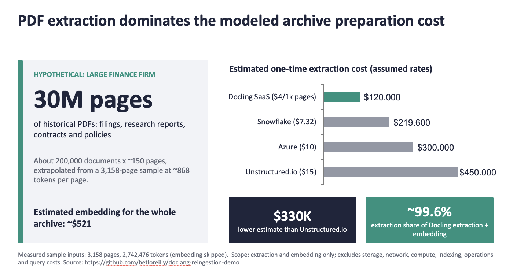
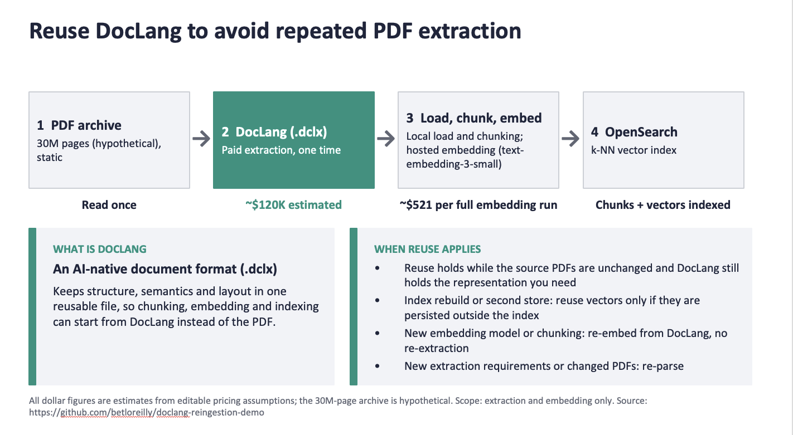
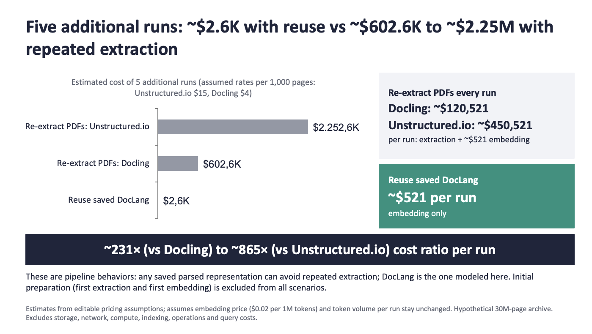
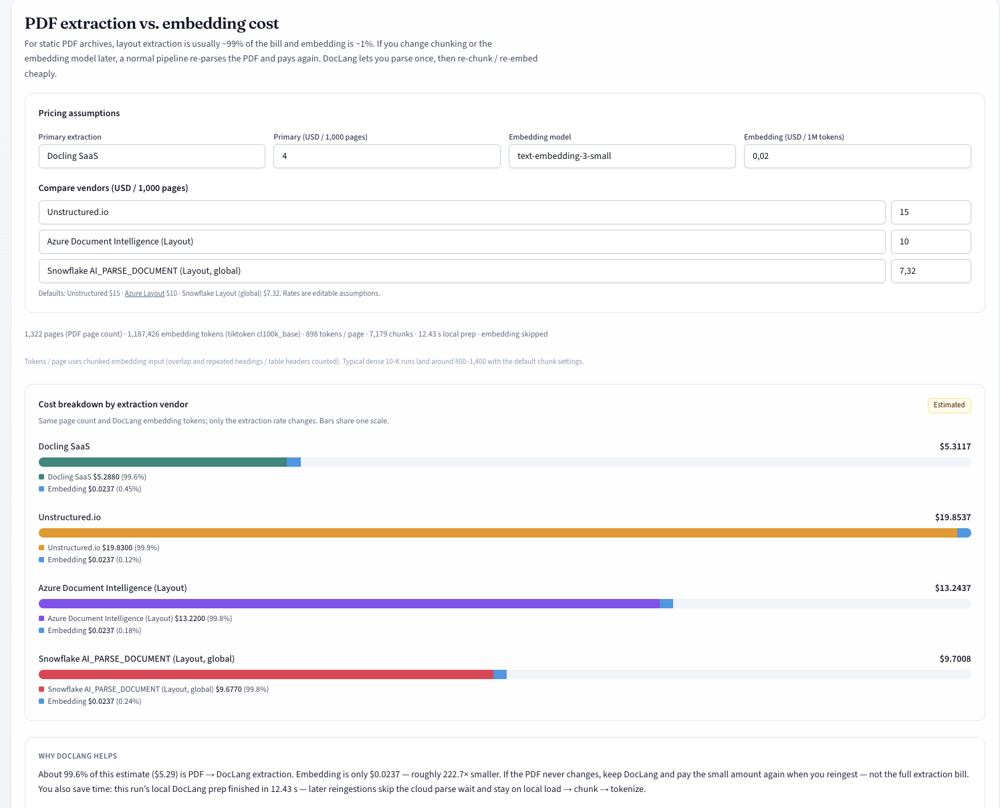
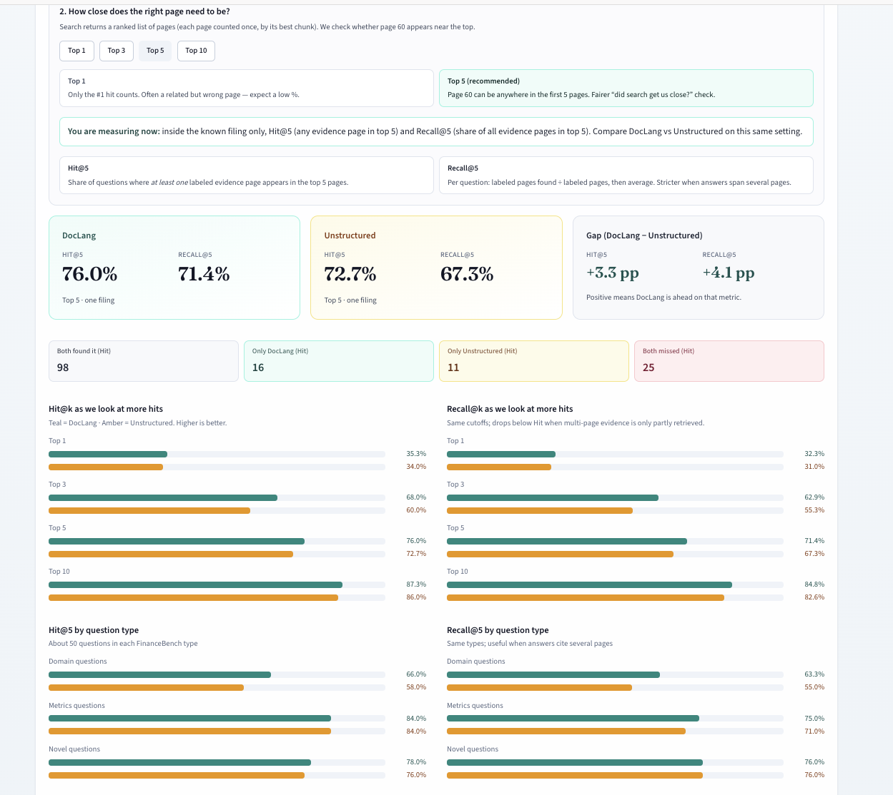
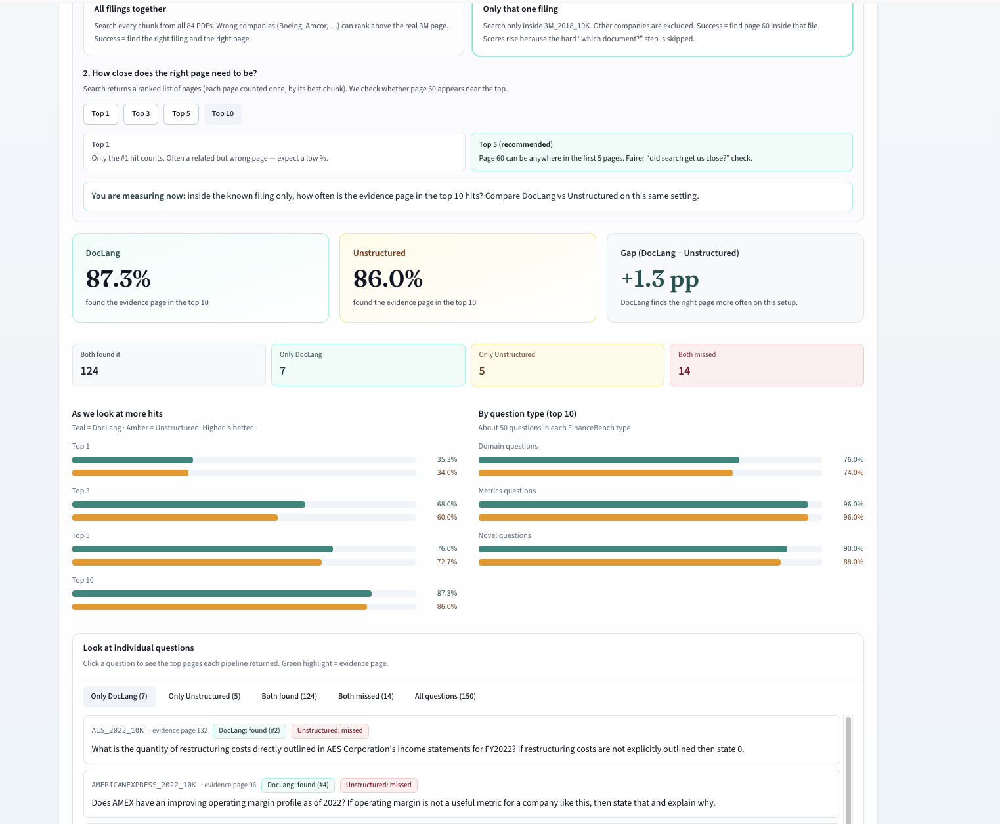

# DocLang Reingestion Savings

Parse PDFs once into [DocLang](https://www.doclang.ai/), keep the `.dclx` files, and reuse them when you re-chunk, re-embed, or rebuild an index. This demo estimates **extraction $ vs embedding $**, and compares **DocLang vs Unstructured** retrieval on FinanceBench (OpenSearch k-NN).

It does **not** run Docling extraction — you bring prepared `.dclx` files. It loads them with [`docling-core`](https://pypi.org/project/docling-core/), counts PDF pages and tokens, and estimates cost. See [DocLang](https://github.com/doclang-project/doclang) and [Docling for IBM watsonx](https://www.ibm.com/products/docling) (SaaS from **$4 / 1,000 pages**).

---

## Why it matters

Static PDF archives (filings, contracts, policies) still need extraction + embedding for RAG. **Extraction dominates the bill.** Re-parsing every time you change chunking or the embedding model is the re-ingestion trap.

Figures below are a **hypothetical ~30M-page** finance archive (~200k docs × ~150 pages), extrapolated from a measured sample (**3,158 pages**, **2,742,476 tokens** ≈ 868 tokens/page). Scope: extraction + embedding only. Prices are assumptions you can edit in the UI. Full deck: [`docs/docling-cost-comparison8.pptx`](docs/docling-cost-comparison8.pptx).

**1. One-time extraction dwarfs embedding** (~$120K Docling vs ~$450K Unstructured; full-archive embed ≈ **$521**; extraction ~**99.6%** of Docling + embed).



**2. Parse once → DocLang → re-embed → OpenSearch.** New model/chunking → re-embed from `.dclx`, no re-extract. Changed PDFs → re-parse.



**3. Five extra runs:** reuse ≈ **$2.6K** (embed only) vs ~**$603K** (Docling re-extract) or ~**$2.25M** (Unstructured) — about **231×–865×** cheaper per run.



**Same pattern in the app** (example run: **1,322 pages**, **1,187,426** tokens → Docling extraction **~$5.29** vs embedding **~$0.024**, ~**223×**; extraction ~**99.6%** of that total). Same pages with Unstructured-rate extraction ≈ **$19.83**.



| Keep DocLang when you… | Re-parse when… |
|------------------------|----------------|
| Change embedding model, chunking, rebuild/second index, iterate / A/B | PDF changes or extraction requirements change |

---

## How cost is estimated

```
extraction $ = pages / 1000 × price_per_1000_pages
embedding $  = tokens / 1e6 × price_per_million_tokens
```

Pages come from the paired PDF (or DocLang / manual). Tokens are counted **after chunking** (overlap + repeated headings), matching what an embedding API would see. Defaults: Docling **$4**, Snowflake **$7.32**, Azure Layout **$10**, Unstructured **$15** per 1k pages; `text-embedding-3-small` at **$0.02 / 1M** tokens. Estimates only — no invoices, no storage/network/compute.

Chunking (`chunking.py`): markdown export → headings/paragraphs/tables → `chunk_size` (default 1000) with heading context and `chunk_overlap` (default 150); large tables keep header rows.

---

## Setup

Requirements: Python 3.12, Node.js 20+, Docker (only for OpenSearch / retrieval).

### Start the app (cost tab)

```bash
# 1. Backend
cd backend
cp .env.example .env          # fill MINIO_* if using object storage; or use local .dclx
python3.12 -m venv .venv && source .venv/bin/activate
pip install -r requirements.txt
uvicorn app.main:app --reload --port 8000

# 2. Frontend (second terminal)
cd frontend && npm install && npm run dev
```

Open http://localhost:3000. Both processes must run (`/api/*` → :8000).

**Documents:** S3-compatible storage (**MinIO is one example** — also IBM COS, Amazon S3, etc.; env names stay `MINIO_*`) or local copies. Layout: `dclx/*.dclx` (required), `pdf/*.pdf` (page count). After download you can use **Local disk**. Never commit `.env`.

**Quick cost run:** select documents → **Cost estimate only** → **Estimate cost**. Change prices afterward; $ updates without a new run.

### Optional: retrieval tab (FinanceBench)

Only needed for DocLang vs Unstructured / OpenSearch scoring (not for cost estimates).

```bash
# Unstructured (isolated venv)
cd backend
python3.12 -m venv .venv-unstructured
.venv-unstructured/bin/pip install -r requirements-unstructured.txt

# OpenSearch (from repo root)
export OPENSEARCH_INITIAL_ADMIN_PASSWORD='your-strong-password'
docker compose up -d
```

In `backend/.env` (same password as above):

```env
OPENAI_API_KEY=...
OPENSEARCH_URL=https://localhost:9200
OPENSEARCH_USER=admin
OPENSEARCH_PASSWORD=your-strong-password
OPENSEARCH_VERIFY_CERTS=false
UNSTRUCTURED_PYTHON=./.venv-unstructured/bin/python
```

Then restart uvicorn. UI: **Estimate** → **Run comparison** (or ingest + **Score OpenSearch**). CLI: `scripts/run_recall.py`, `ingest_recall_opensearch.py`, `evaluate_opensearch.py`. Code under `backend/app/recall/`.

---

## Retrieval quality (FinanceBench)


Same 150 questions / 84 SEC filings, same chunking and embedding model; only the text source differs: **DocLang** (`.dclx`) vs **Unstructured** `partition_pdf` (`fast`). FinanceBench pages are 0-based; we use PDF page = label + 1.

We rank **distinct pages** (best chunk per page). **Hit@k** = ≥1 evidence page in top *k*. **Recall@k** = mean of `|E ∩ top-k| / |E|` (stricter on multi-page evidence).

**Hit@k** (OpenSearch, 150 questions):

| Scope | | Top 1 | Top 5 | Top 10 |
|-------|---|-------|-------|--------|
| All filings | DocLang | 24.0% | 50.7% | 66.0% |
| | Unstructured | 16.0% | 46.0% | 59.3% |
| One filing | DocLang | 35.3% | 76.0% | 87.3% |
| | Unstructured | 34.0% | 72.7% | 86.0% |

**One filing at a time** also reports Recall (screenshots below): Top 5 DocLang **71.4%** vs Unstructured **67.3%** (+4.1 pp); Top 10 **84.8%** vs **82.6%** (+2.2 pp).





Compare DocLang vs Unstructured **in the same scope**. Top 1 is low for both (related pages often rank first). Vector search only — no keyword/reranker. Setup steps are under **Optional: retrieval tab** above.

---

## Tests & limits

```bash
cd backend && source .venv/bin/activate && pytest -q
```

No sample `.dclx` in the repo (bring object storage or local files). Embedding $ is an estimate. Optional local Qwen full runs are slow on CPU. Page count needs a PDF, DocLang pages, or a manual value.
